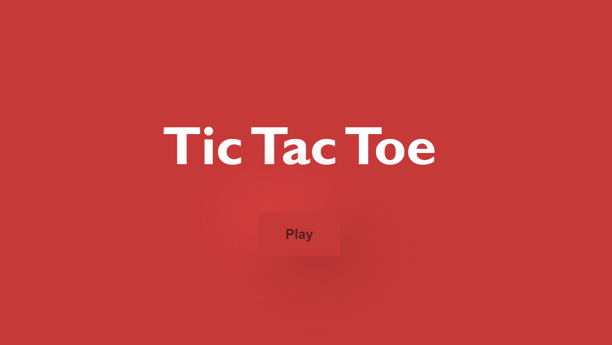
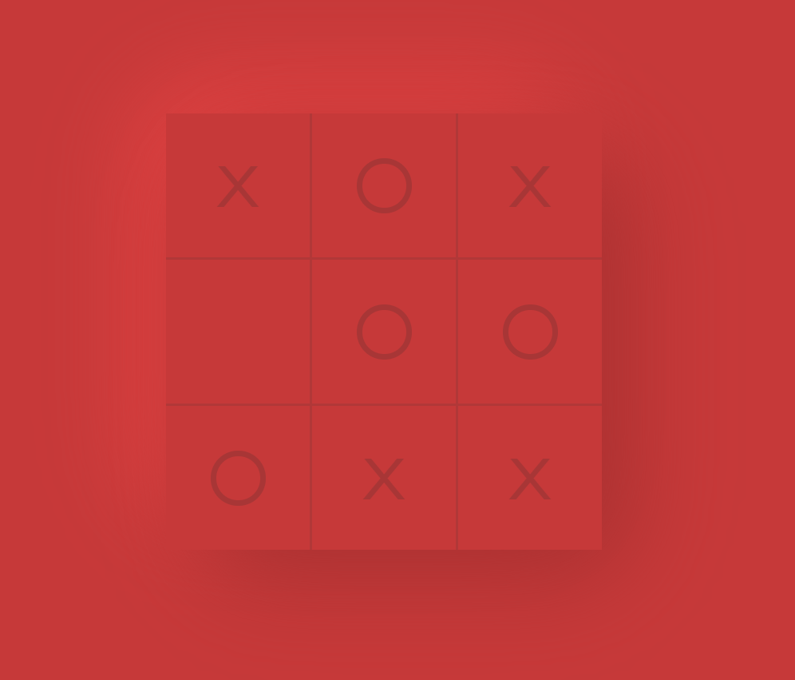

# <h1 align="center">:x: Unbeatable Tic-Tac-Toe :o:</h1>

 

 

 
 

---

**Sem IV Analysis of Algorithms project**

Single player unbeatable tic-tac-toe built using the minmax algorithm.  
UI consists of Neumorphic design.

### Installing:
- In the root folder (frontend), run `yarn` to install all dependencies
- In the api folder:
  - `cd api`
  - `yarn`

### Usage:

#### Run the frontend Vue server:
- yarn dev 

#### Run the API:
- cd api
- yarn dev

### Working app:

### Future Scope:

- [ ] Cache all the results of the first iteration to avoid repeated calculations
- [ ] Give user ability to go second
